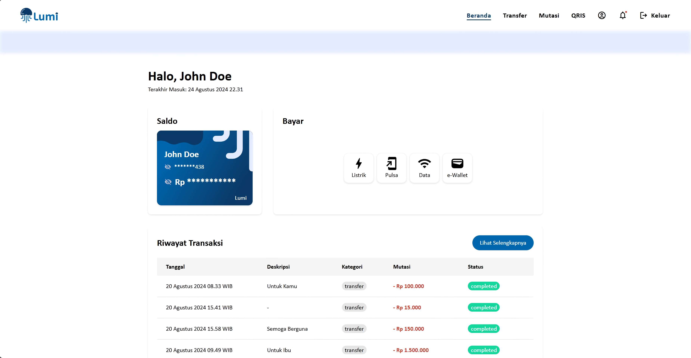

# Lumi - Accessibility Banking App

Lumi is a cutting-edge accessibility banking app that breaks down barriers for friends with special needs, such as blind friends. With advanced feature like seamless screen reader integration, Lumi provides a personalized banking experience. Our app is designed to be intuitive and easy to use, empowering users to manage their finances with confidence and independence.

## Table of Contents

- [Overview](#overview)
  - [Screenshot](#screenshot)
  - [Links](#links)
  - [Features](#features)
- [The Process](#the-process)
  - [Built with](#built-with)
- [Authors](#authors)
- [License](#license)

## Overview

### Screenshot

### Links

- Live Site URL : [lumibank.netlify.app](https://lumibank.netlify.app/)

### Features

- Login
- Registration
- Check User Balances
- View Mutations
- Transfer Funds Between Banks
- Generate QRIS Code
- View Notifications

## The Process

### Built With

- [Vite](https://vitejs.dev/) - Next Generation Frontend Tooling
- [TypeScript](https://www.typescriptlang.org/) - JavaScript with syntax for types
- [React](https://react.dev/) - The library for web and native user interfaces
- [TailwindCSS](https://tailwindcss.com/) - A utility-first CSS framework
- [Axios](https://axios-http.com/) - Promise based HTTP client
- [Zustand](https://github.com/pmndrs/zustand) - Bear necessities for state management

## Authors

- [Andromedha Anjar Wasari](https://github.com/andromedhaaw)
- [Fadhilah Farhan](https://github.com/smollMushroom)
- [Faiza Akmal Zaidaan](https://github.com/faizakmalz)
- [Fajar Riski Hidayat](https://github.com/fajarriskihidayat)
- [Lianna Rizky Gunawan](https://github.com/liannarg66)
- [Linda Yanti Yo](https://github.com/YYanti00)
- [Mhd Zulfikar Pinem](https://github.com/zulfikarpinem)
- [Vistar Tiop Raja Gukguk](https://github.com/vistartr)

## License

Distributed under the MIT License. See `LICENSE` file for more information.
